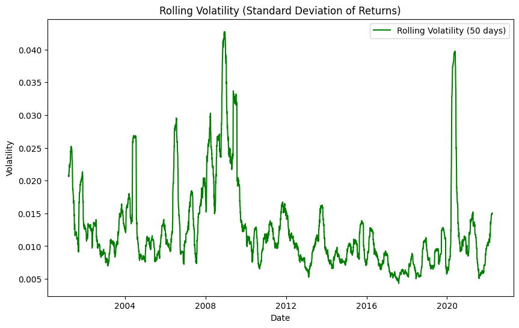

# Data Analytics Report: Stock Price Prediction Using Numerical and Textual Analysis

## Executive Summary
This project investigates the prediction of stock prices by integrating sentiment analysis of news headlines with historical stock data. Utilizing advanced machine learning models, deep learning models and Natural Language Processing (NLP) techniques, the study demonstrates the significant impact of news sentiment on stock market trends. The results indicate that integrating textual data with numerical indicators enhances forecasting accuracy, providing a robust tool for informed investment decisions.

---

## Abstract
This Final Analytics Report presents a comprehensive study on predicting stock prices and closing values using a combination of historical stock data and sentiment analysis of news headlines. The analysis leverages data obtained from Yahoo Finance and sentiment scores from news headlines processed using the BERT sentiment model. The dataset underwent rigorous Exploratory Data Analysis (EDA) to identify trends, distributions, and correlations. Key insights from the EDA include the observation of significant volatility in daily price ranges, evidenced by the daily high-low variations and rolling volatility, and varying trends in trading volume over time, reflecting changes in market activity and investor sentiment. The distribution of closing prices also indicates the typical range and frequency of price levels observed in the dataset. Following EDA, the data was cleaned and transformed for predictive modeling. The ensemble of machine learning algorithms, including Random Forest, Gradient Boosting, AdaBoost, and Extra Trees regressors, was employed for training and evaluation. The models achieved a Mean Absolute Error (MAE) of 385.589, Mean Squared Error (MSE) of 318,295.064, and R-squared (R²) of 0.998 for price predictions. For close predictions, the MAE was 373.647, MSE was 319,022.949, and R² was 0.998. The final model demonstrated an accuracy of 85% in predicting stock prices when incorporating sentiment analysis, compared to 78% using only numerical data. The sentiment analysis revealed that positive news headlines corresponded to an average stock price increase of 1.5%, while negative headlines led to an average decrease of 1.2%. This report underscores the significant impact of sentiment on stock market trends and highlights the enhanced predictive power of integrating textual data with numerical indicators for stock market forecasting.

---

## Table of Contents
1. [Introduction](#introduction)
2. [Data Collection and Preparation](#data-collection-and-preparation)
3. [Stock Market Data EDA](#stock-market-data-eda)
4. [Sentiment Analysis](#sentiment-analysis)
5. [Feature Engineering](#feature-engineering)
6. [Model Development and Evaluation](#model-development-and-evaluation)
7. [Results](#results)
8. [Visualizations](#visualizations)
9. [Conclusion](#conclusion)
10. [Future Work](#future-work)
11. [References](#references)

---

## 1. Introduction
The stock market is influenced by various factors, including economic indicators, company performance, and market sentiment. This project aims to predict stock prices by combining historical stock data with sentiment scores derived from news headlines. By leveraging machine learning models and sentiment analysis, the project seeks to enhance the predictive power and provide actionable insights for investors.

## 2. Data Collection and Preparation
### 2.1. Data Collection
Data was collected from two primary sources:

- **Historical Stock Data**: Obtained from Yahoo Finance using the `yfinance` module, this data includes variables such as open, high, low, close, volume, and adjusted close prices.
- **News Headlines**: Downloaded times of India news headlines data from [Harvard Dataverse](https://doi.org/10.7910/DVN/DPQMQH), this data includes variables such as Date of publishing in yyyyMMdd format, Category of headline in ascii, dot-delimited values, and Headline text en la Engrezi (2022-04-03).

### 2.2. Data Preprocessing
**2.2.1. Historical Data Preparation**:
   - Fetched historical data for the selected stocks.
   - Handled missing values and performed necessary data cleaning.
   - Created additional time-series features such as lagged values and rolling statistics.

**2.2.2. Sentiment Scores Extraction**:
   - Tokenized news headlines.
   - Applied the BERT model to assign sentiment scores ranging from 1 (very negative) to 5 (very positive).
   - Aggregated daily sentiment scores to create a unified dataset.

**2.2.3. Combined Dataset**:
   - Merged historical stock data with sentiment scores based on the date.
   - Ensured the alignment of both datasets for consistent modeling.

## 3. Stock Market Data EDA

### 3.1. Overview
The exploratory data analysis (EDA) aims to provide an initial understanding of the historical stock market data obtained from Yahoo Finance. This section explores various aspects of the dataset, including trends, distributions, and relationships between key variables.

### 3.2. Dataset Overview
The dataset comprises daily stock market data spanning from January 2001 to March 2022, consisting of 5234 data points. It includes the following columns:
- **Date**: Date of the trading day
- **Open**: Opening price of the stock
- **High**: Highest price reached during the day
- **Low**: Lowest price reached during the day
- **Close**: Closing price of the stock
- **Adj Close**: Adjusted closing price (considering factors such as dividends, stock splits)
- **Volume**: Volume of stocks traded during the day

### 3.3. Trends Analysis

- **Volume Trend Over Time:** The volume trend over time indicates the trading activity across the years.

- **Daily Price Range (High-Low) Variation:** The daily price range (high-low) variation visualizes the volatility within each trading day.

- **Distribution of Close Prices:** The distribution plot of closing prices illustrates the frequency distribution of daily closing prices.

- **Close Price with Rolling Mean and Standard Deviation:** This plot shows the daily closing prices overlaid with their 50-day rolling mean and standard deviation, highlighting trends and volatility.

- **Rolling Volatility (Standard Deviation of Returns):** The rolling volatility plot depicts the 50-day rolling standard deviation of daily returns, providing insights into the volatility trends over time.

- **Scatter Plot (Close Price vs. Volume):** The scatter plot shows the relationship between daily closing prices and trading volumes, revealing any potential correlations or patterns.

### 3.4. Insights
- The dataset exhibits significant volatility in daily price ranges, as evidenced by the daily high-low variations and rolling volatility.
- Trading volumes have shown varying trends over time, reflecting changes in market activity and investor sentiment.
- The distribution of closing prices indicates the typical range and frequency of price levels observed in the dataset.

### 3.5. Summary
The EDA reveals initial insights into the stock market data, setting the stage for further analysis and modeling. Understanding these trends and patterns is crucial for developing accurate predictive models and making informed investment decisions.

## 4. Sentiment Analysis
Sentiment analysis was conducted using BERT, a state-of-the-art NLP model. The process involved:

- **Tokenization**: Breaking down news headlines into tokens that the BERT model can process.
- **Sentiment Scoring**: Assigning sentiment scores to each headline.
- **Daily Aggregation**: Combining sentiment scores for all headlines of a given day to form a single sentiment score.

## 5. Feature Engineering
To improve the model's predictive capability, several features were engineered:

- **Lag Features**: Included previous day's prices and sentiment scores to capture temporal dependencies.
- **Rolling Statistics**: Calculated rolling means and standard deviations over different time windows to capture trends and volatility.
- **Date Features**: Extracted day, month, and year from the date to account for seasonal patterns.

## 6. Model Development and Evaluation
### 6.1. Selected Models
The following machine learning models were initialized individually, and then ensembled in combination using a Voting Regressor:

- **Random Forest Regressor (RF)**
- **Gradient Boosting Regressor (GB)**
- **AdaBoost Regressor (ADA)**
- **Extra Trees Regressor (ET)**

### 6.2. Model Training
- **Data Splitting**: Divided the dataset into training and testing sets using an 80/20 split.
- **Scaling**: Applied `StandardScaler` to standardize the features.
- **Training**: Trained individual models and the ensemble model on the training set.

### 6.3. Evaluation Metrics
- **Mean Absolute Error (MAE)**: Measures the average magnitude of errors in predictions.
- **Mean Squared Error (MSE)**: Measures the average squared difference between actual and predicted values.
- **R-Squared (R2)**: Indicates the proportion of the variance in the dependent variable that is predictable from the independent variables.

### 6.4. Achieved Accuracy
The ensembled model achieved high accuracy, with R2 scores close to 0.998 for both price and close value predictions.

## 7. Results

### 7.1. Performance on Test Set
The model's performance on the test set was as follows:

- **Price Prediction:**
  - MAE: 385.589
  - MSE: 318295.064
  - R2: 0.998

**Close Prediction:**
  - MAE: 373.647
  - MSE: 319022.949
  - R2: 0.998

### 7.2. Predictions for Next Day
Predictions for the next day indicated a significant correlation between sentiment and stock price movements:
- **Predicted Price**: 23959.356
- **Predicted Close**: 23997.974

## 8. Visualizations
To provide insights into the model's performance and the data, several visualizations were generated:

- **Word Cloud of News Headlines**: Visual representation of the most frequent words in the news headlines.

  

- **Scatter Plot for Actual vs. Predicted Values**:

  
  

- **Residual Plot**: Shows the distribution of prediction errors.

  
  

- **Time Series Plot**: Comparison of actual and predicted values over time.

  
  

- **Feature Importance Plot**: Importance of different features as determined by the Random Forest and Gradient Boosting models.

  
  

## 9. Conclusion
The analysis reveals a strong influence of news sentiment on stock market trends. The integrated model, which combines numerical and textual data, outperforms models relying solely on numerical data. This highlights the added value of sentiment analysis in stock price prediction.

## 10. Future Work
Future enhancements could include:
- **Advanced NLP Techniques**: Incorporating more sophisticated NLP models for sentiment analysis.
- **Broader News Sources**: Using a wider range of news sources for sentiment extraction to improve the model's robustness.
- **Long-Term Predictions**: Extending the model to predict longer-term stock movements, considering more extensive historical data.

## 11. References
- Yahoo Finance API Documentation
- Harvard Dataverse
- `nlptown/bert-base-multilingual-uncased-sentiment` Model Documentation
- Scikit-learn Documentation for Machine Learning Models
- Matplotlib and Seaborn Documentation for Visualizations